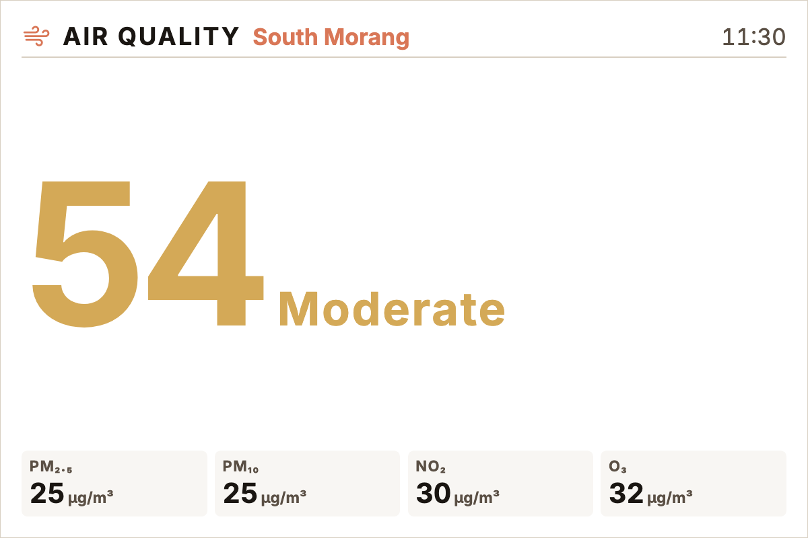
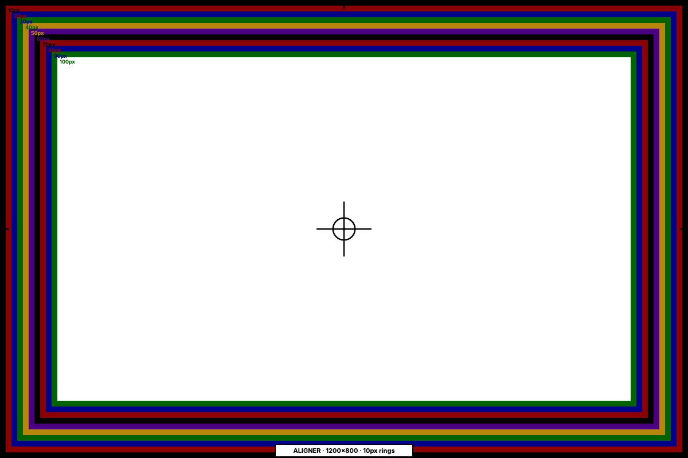

# Inky Dash

Flask companion that composes dashboards in the browser, renders them through Playwright + Pillow, and pushes them to a Pimoroni Inky Impression e-ink panel over MQTT. Drop a folder under `plugins/` and you have a new widget; drop another and you have a new theme. The Pi-side listener lives in [dmellok/inky-dash-listener](https://github.com/dmellok/inky-dash-listener) — the MQTT wire format is byte-for-byte identical to v3, so the same listener works on both.

This is **v4**. The v3 → v4 rationale lives in [`docs/v4-brief.md`](docs/v4-brief.md); the plugin contract lives in [`docs/v4-plugins.md`](docs/v4-plugins.md); the v3 source is archived at the [`v3-final`](https://github.com/dmellok/inky-dash/tree/v3-final) tag.


## Quick start

```bash
# Python side
python -m venv .venv && source .venv/bin/activate
pip install -e ".[dev]"
python -m playwright install chromium

# JS side (Bun in CI; npm works locally too)
bun install && bun run build      # or: npm install && npm run build

# Configure MQTT before launching if you want to push to a real panel:
#   export MQTT_HOST=192.168.1.50              # broker the Pi listener subscribes to
#   export COMPANION_BASE_URL=http://192.168.1.10:5555  # how the Pi reaches us
python -m app
# http://localhost:5555/
```

Python 3.11+ required. Pre-flight checks:

```bash
ruff check . && ruff format --check . && mypy && pytest
```

## What's in the box

- **Dashboard editor** — split the panel into cells from a layout picker, click a cell to configure its widget + theme + font in the sidebar, live preview rendered in an iframe. Saved pages live in [`data/core/pages.json`](data/core/pages.json).
- **27 widget plugins** — clock, weather, todo, world clock, year-progress, sun & moon, AQI, AQI trend, HN, news (RSS), gallery, APOD, Unsplash, Wikimedia Picture of the Day, GitHub contributions heatmap, weather radar, star map, generative art, Home Assistant tile, Melbourne PTV departures, countdown, note, xkcd, webpage screenshot, calibration, frame aligner.
- **36 hand-curated themes** — Paper / Linen / Mist / Sage / Bloom / Slate / Kraft / Moss / Coral / Dusk / Lavender + 15 monochromatic + 5 neon (Hotwire / Plasma / Matrix / Synthwave / Toxic). Each grouped into Light · Medium · Dark in the picker. Build your own at `/themes`.
- **Schedules** — one-shot daily-at-HH:MM or every-N-minutes, with day-of-week + time-of-day-window guards. Backfill-safe (won't replay a day's worth of fires when re-enabled mid-day).
- **Send page** — push any image, saved dashboard, image URL, or arbitrary webpage to the panel right now. Includes fit modes (fit / fill / stretch / center / blurred-bg) for one-off images, plus a history tab with thumbnails, resend, delete, and a click-to-zoom lightbox.
- **Per-cell theme overrides** — each cell can paint in its own theme without affecting siblings.
- **MQTT push pipeline** — single-flight `PushManager` with identical-push debounce, content-addressed render cache, LRU eviction, and a full push history.

## Editor

Click any cell in the live-preview to edit it. Theme, font, and matting apply to the whole page; cells can override theme + font individually.

| Editor list | Editor |
|---|---|
|  |  |

The cell sidebar surfaces every option each plugin declares in its manifest — text fields, numbers, booleans, selects, and dynamic dropdowns (e.g. todo's list picker, gallery's folder picker). Per-cell colour overrides let you nudge individual tokens (`accent`, `surface`, `divider`, etc.) without forking the theme.

## Widgets

Every widget shares a baseline of design tokens defined in [`static/style/widget-base.css`](static/style/widget-base.css) — same header strip, same flat surface tiles, same status pills — so the panel reads as one design system.

### Information widgets

| Weather | Hacker News | News (RSS) |
|---|---|---|
|  |  |  |

| Todo | Year progress | World clock |
|---|---|---|
|  |  |  |

| Sun & moon | Air-quality trend | Air quality |
|---|---|---|
|  |  |  |

| GitHub contributions | Countdown | Note |
|---|---|---|
|  |  |  |

| Clock | Star map | Frame aligner |
|---|---|---|
|  |  |  |

### Visual widgets

| Generative art | Wikimedia POTD |
|---|---|
|  |  |

Plus APOD, Unsplash, gallery (folder rotation with portrait/landscape/square filter), xkcd, weather radar (RainViewer + CartoDB), and webpage-screenshot widgets. All can be set `full_bleed` so they paint edge-to-edge with no surrounding chrome.

### Smart-home + transit

- **Home Assistant tile** — bundle up to 8 HA entities into a tile (grid, list, or hero layout). Needs a long-lived access token in `/settings`.
- **Melbourne PTV** — live train/tram/bus/V-Line departures for any PTV stop. Needs a free PTV dev ID + API key; lookup tool at `/plugins/ptv/?q=...`.

## Schedules

Schedules fire pushes automatically. Each row gets a deterministic per-schedule colour so the day-band timeline reads at a glance. The "now" cursor slides across all rows in unison; the band starts at 06:00 so each calendar day reads top-down naturally.


Two schedule types:
- **Interval** — every N minutes within an optional `time_of_day_start..end` window on selected days of the week.
- **Daily** — once a day at HH:MM on selected days. Mid-day enables don't backfill the morning's missed firings.

## Send page

Push anything right now. Source tabs across the top: File / Saved dashboard / Image URL / Webpage / History.

| Send (compose) | Send (history) |
|---|---|
|  |  |

The preview pane renders at panel aspect-ratio with the Floyd–Steinberg quantizer the panel will see. Fit modes for File + Image URL: **fit** (letterbox) · **fill** (cover-crop) · **stretch** (distort) · **center** (no scaling) · **blurred** (server-side composite — blurred cover-fit background with the original aspect-preserved on top).

The History tab is the live `PushManager` history with thumbnails of every published render. Click a thumbnail for a full-screen zoom; the resend button re-publishes the exact stored render without re-rendering; delete removes the row and (when no other row references the same digest) the PNG too.

## Themes

36 themes grouped by lightness — Light (paper, mist, sage, …) · Medium (linen, kraft, moss, …) · Dark (ember, midnight, plasma, …). The theme picker shows a preview mock that paints with every palette token so any theme regression is visible immediately. Build a new theme at `/themes`; user-created ones are saved alongside the built-ins.


## Settings

Per-plugin settings (the manifest declares which fields each plugin exposes), app-level MQTT + panel + base-URL config, and theme-builder admin. Secrets are masked over the wire — they live server-side and never round-trip back to the browser.


## Index

The status page summarises everything at a glance: MQTT bridge state, last push, listener log, available pages, scheduled jobs.


## Layout

```
app/                Flask application
  state/            mypy --strict — page model + stores (pages, schedules, history)
  composer.py       /compose/<page_id> + /_test/render (cell hydration, theming, fonts)
  admin.py          editor blueprint + /api/pages + /api/send + history endpoints
  push.py           mypy --strict — single-flight PushManager with debounce + LRU
  scheduler.py      tick loop, day-of-week + time-of-day windows, first-seen guard
  renderer.py       mypy --strict — Playwright wrapper, screenshot at panel resolution
  quantizer.py      Pillow gamut projection (Spectra 6) + Floyd–Steinberg
  image_ops.py      Server-side composites for the send pipeline (blurred-fit)
  mqtt_bridge.py    paho-mqtt publisher + listener-status subscriber; NullBridge fallback
docs/
  v4-brief.md       Build brief + milestone roadmap
  v4-plugins.md     Plugin contract
  screenshots/      Documentation screenshots (used by this README)
plugins/<id>/       Drop-a-folder plugin (kind=widget|theme|font|admin)
schema/             JSON Schemas (plugin manifest, page model)
static/
  components/       Lit design system (id-* web components)
  lib/              Shared modules (push-state.js, vendored Chart.js, …)
  pages/            Editor + send + schedules + themes + settings entry points
  style/            widget-base.css (shared widget chrome), tokens.css
  composer.js       Mounts plugins into shadow DOMs per cell
templates/          Jinja shells: compose, editor, send, schedules, themes, settings
tests/              Top-level pytest suite (push, scheduler, history, composer)
conftest.py         Root fixtures shared with plugin smoke tests
tools/              gen-page-types.mjs (schema → .d.ts)
.github/            CI: Python + Bun + Playwright + bundle build
```

## Writing a plugin

A widget is a folder under `plugins/<id>/` with:

- `plugin.json` — manifest declaring sizes, cell options, settings, render hints (dither, full_bleed)
- `client.js` — default export `render(host, ctx)` that paints into a shadow-DOM host element
- `client.css` — widget styling (link `/static/style/widget-base.css` for the shared chrome)
- `server.py` (optional) — declares `fetch(options, settings, ctx)` for data, plus optional Flask `blueprint()` for an admin UI

See [`docs/v4-plugins.md`](docs/v4-plugins.md) for the full contract.

## License

MIT.
