# Inky Dash

A Flask companion for [Pimoroni Inky Impression](https://shop.pimoroni.com/products/inky-impression-7-3) e-ink panels. Build dashboards in the browser, render them to PNG via headless Chromium, and push the result to your panel over MQTT.

Composable widgets, themeable everything, drag-and-drop schedule priorities, push-from-anywhere over the LAN.

   

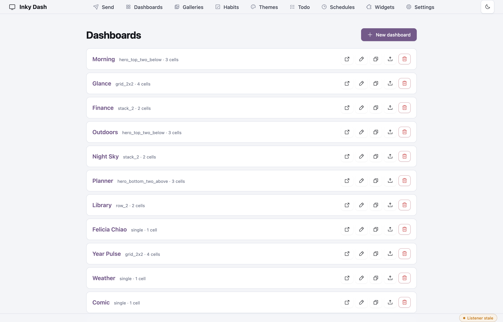

> **Hardware tested:** built and verified against a [13.3" Inky Impression](https://shop.pimoroni.com/products/inky-impression-13-3) (1600×1200) only. The renderer reads `PANEL_WIDTH` / `PANEL_HEIGHT` from `.env`, so other Impression sizes (4", 5.7", 7.3") *should* work — but I don't own one to confirm widget layouts hold up at smaller resolutions. Reports + PRs welcome.

---

## What it does

- **Dashboards.** Compose pages from cell layouts (single, stack, row, hero, grid) populated with plugin-rendered widgets — weather, calendar, todo, news, xkcd, NASA APOD, image galleries, arbitrary webpages, more.
- **Themes.** 19 bundled themes split between light and dark, plus a theme builder UI. Each theme exposes the full `bg / surface / surface-2 / fg / fg-soft / muted / accent / accent-soft / divider / danger / warn / ok` palette, applied per-cell via shadow DOM CSS variables.
- **Fonts.** 38 bundled woff2 fonts in three flavours — modern, mid-century, thick punchy — with a global weight picker filtered to whatever weights each font ships with.
- **Schedules.** Interval and one-shot schedules with day-of-week masks. Drag rows to set priority — when several fire at the same tick, the topmost wins.
- **Push.** A unified `/send` page accepts files, URLs, live webpages and saved dashboards, all going through one render → publish pipeline with a panel-aspect live preview, history, and replay.
- **Plugins.** Drop a folder into `plugins/` with a `plugin.json` manifest, optional `server.py` (`fetch()` / `blueprint()` / `choices()`), and `client.{js,css}`. The loader picks them up at boot. ~30 plugins ship in the box (clock, weather, calendar, todo, news, xkcd, NASA APOD, gallery, Unsplash, webpage, Hacker News, Wikipedia, on-this-day, world clock, countdown, year progress, sun/moon, sun clock, moon calendar, wind compass, tide chart, air quality, earthquakes, FX rates, crypto, sticky note, habit grid, plus theme + font cores) all built against the same contract.

## Dashboards

A few of the bundled dashboard layouts rendered at panel resolution — each
cell carries its own theme so the page reads as a tonally distinct
composition:

| Morning | Glance | Outdoors |
| --- | --- | --- |
| 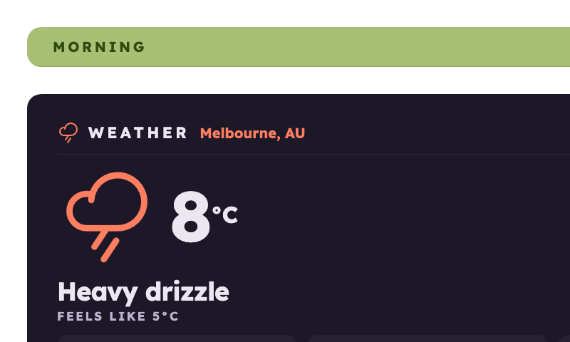 | 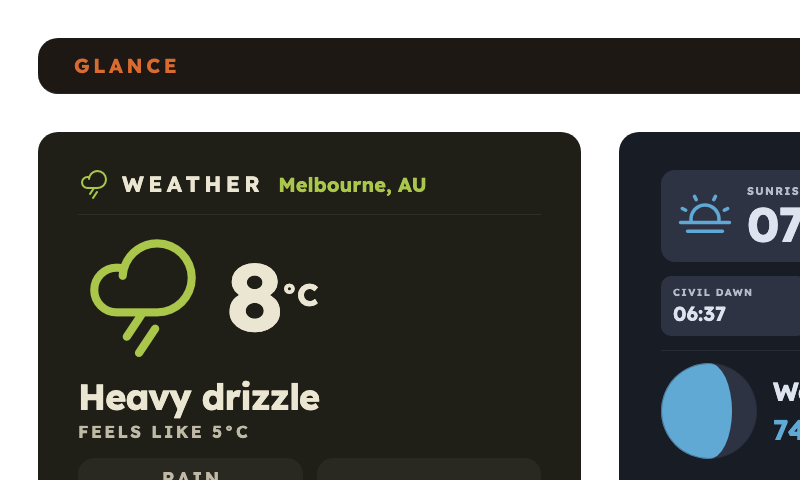 | 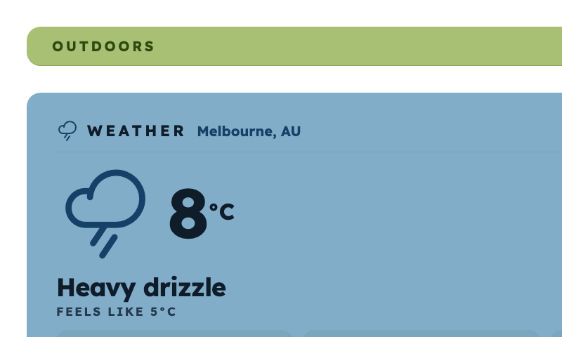 |
| `hero_top_two_below` · clock + weather + todo | `grid_2x2` · weather + sun & moon + HN + FX | `hero_top_two_below` · weather + wind + tide |

| Night Sky | Year Pulse | Earth Pulse |
| --- | --- | --- |
| 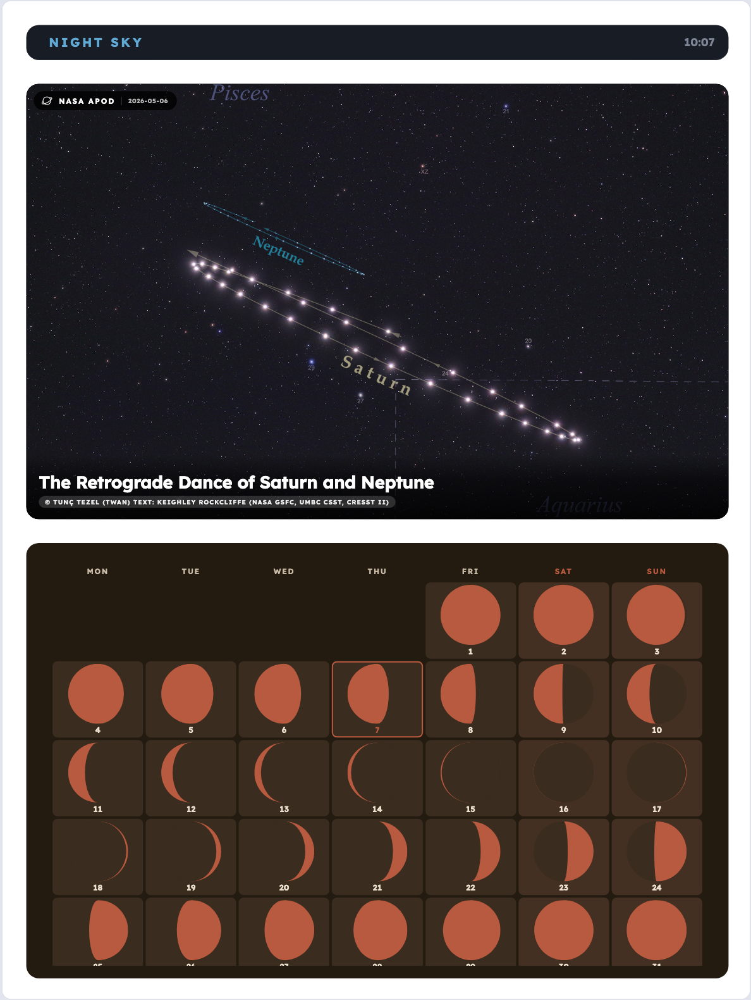 | 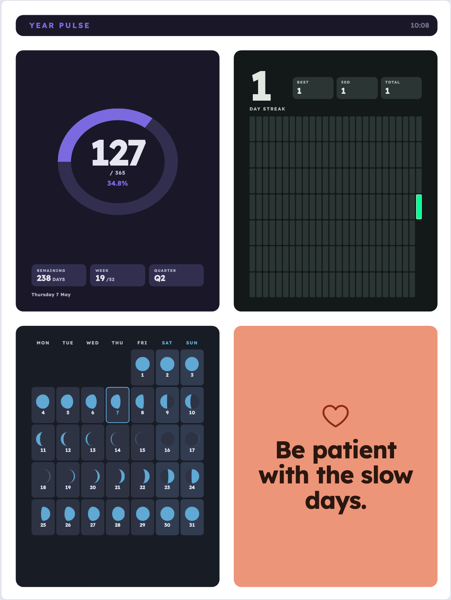 | 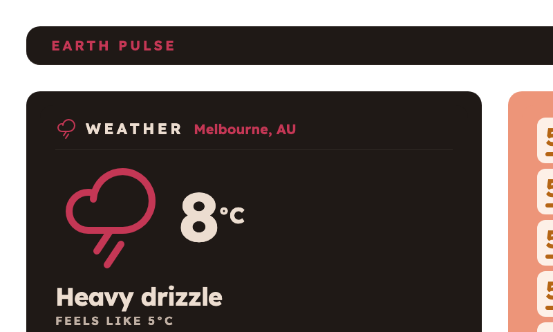 |
| `stack_2` · NASA APOD + moon calendar | `grid_2x2` · year ring + habits + moon + sticky | `row_2` · air quality + earthquakes |

| Planner | Finance |
| --- | --- |
| 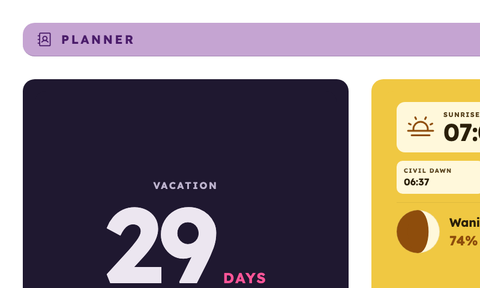 | 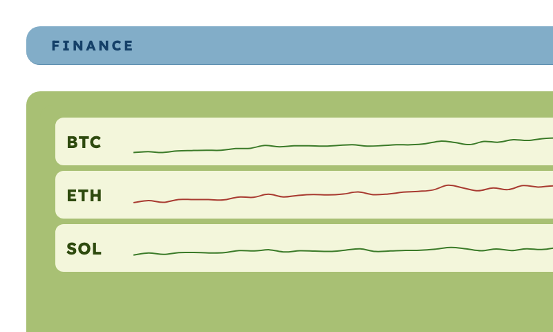 |
| `hero_bottom_two_above` · countdown + sun & moon + calendar | `stack_2` · crypto + FX with sparklines |

## Admin UI

The companion ships a small admin UI that lives at `http://<host>:5555/`.

| Dashboard editor | Theme builder |
| --- | --- |
| 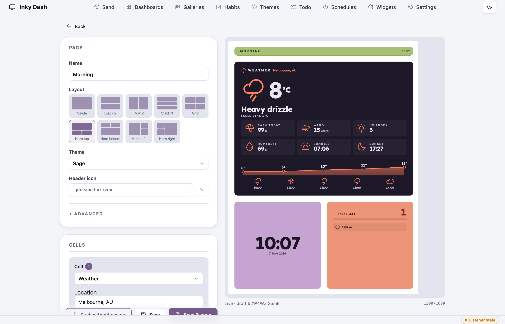 | 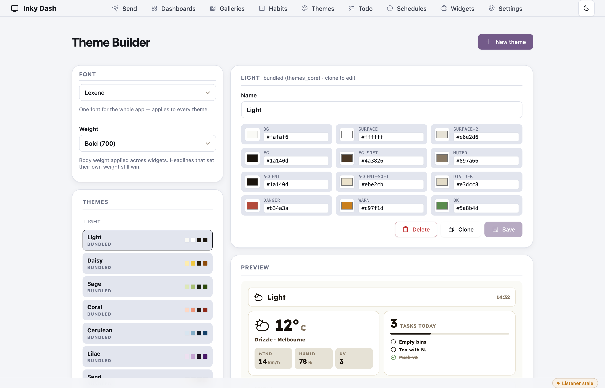 |
| Drop cells into a layout, theme each one independently, see the live preview at panel aspect ratio. | Edit any palette key with a colour picker, preview against a real widget, save user themes alongside the bundled ones. |

| Send page | Schedules |
| --- | --- |
| 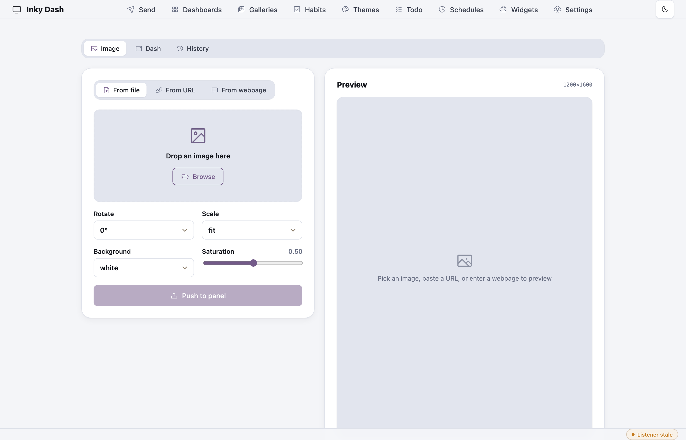 | 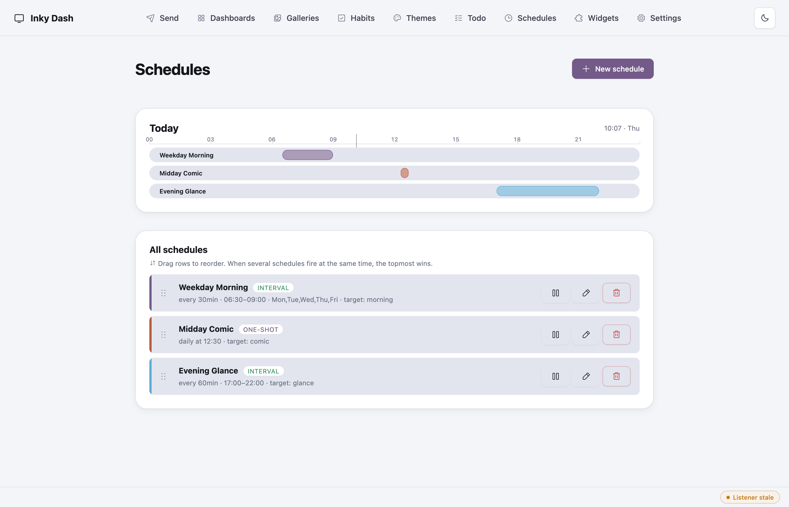 |
| Push files / URLs / webpages / saved dashboards through one pipeline with a panel-aspect live preview and replayable history. | Drag rows to set priority — when several schedules fire in the same tick the topmost wins. Daily timeline shows tonight's coverage at a glance. |

| Settings | Plugins |
| --- | --- |
| 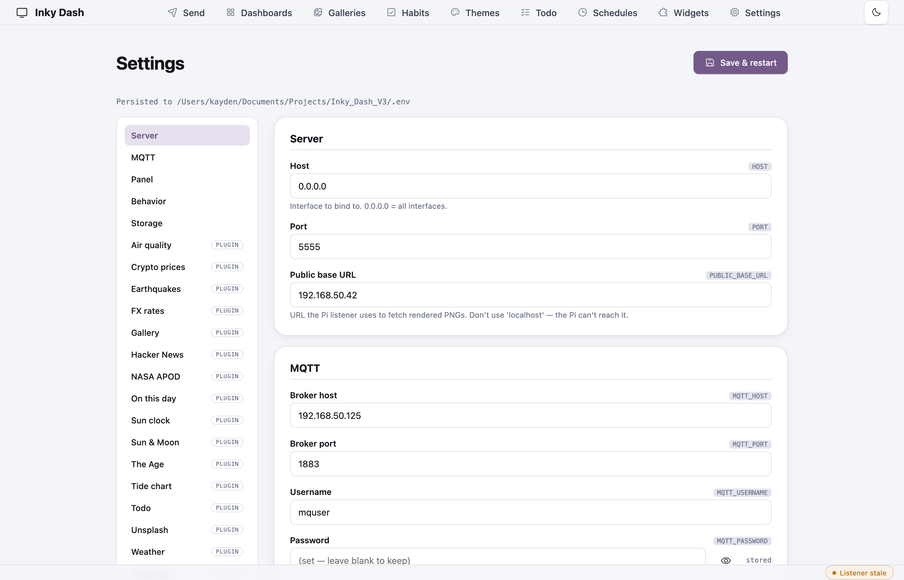 | 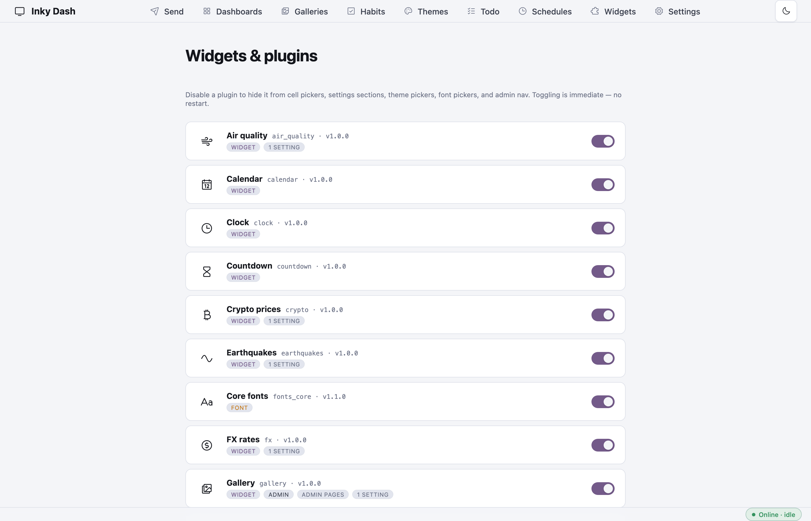 |
| Panel preset auto-detect, MQTT, all plugin settings in one merged page. Save & restart resets cleanly. | Enable/disable plugins per-install. Plugins ship their own settings sections that fold into `/settings` automatically. |

## Architecture in one diagram

```
   browser                companion (this repo)              panel
   ┌────────┐  HTTP    ┌─────────────────────────┐       ┌──────────┐
   │ /send  │─────────▶│  Flask                  │       │ listener │
   │ /comp* │          │   ├ composer (HTML+CSS) │       │ (Pi)     │
   └────────┘          │   ├ plugin loader       │       │          │
                       │   ├ schedule + push     │       │          │
                       │   └ history (SQLite)    │       │          │
                       │                         │ MQTT  │          │
                       │  Playwright ──────PNG──▶│──────▶│  paint   │
                       └─────────────────────────┘       └──────────┘
```

## Quickstart

```bash
git clone https://github.com/dmellok/inky-dash.git
cd inky-dash

# Python 3.11+ recommended
python3 -m venv .venv
source .venv/bin/activate
pip install -r requirements.txt
playwright install chromium

# Configure — copy the example and fill in panel size, MQTT, API keys
cp .env.example .env
$EDITOR .env

# Run
python app.py
# → http://localhost:5555
```

The first launch creates `data/` (pages, schedules, todos, history.db, render cache). Open `/widgets` to enable/disable plugins, `/schedules` for cron-style runs, and `/dashboards/new` to compose your first page.

## Configuration

`.env` (see `.env.example` for the template):

| Var | Default | Notes |
|---|---|---|
| `HOST` / `PORT` | `0.0.0.0` / `5555` | Flask bind |
| `PUBLIC_BASE_URL` | `http://localhost:5555` | URL the panel listener fetches PNGs from |
| `PANEL_WIDTH` / `PANEL_HEIGHT` | `800` / `480` | Native panel resolution. Portrait (height > width) is detected automatically and adds a base 90° rotation to pushed renders. |
| `MQTT_*` | — | Topics + creds for the panel listener |
| `REFRESH_LOCKOUT_SECONDS` | `30` | Minimum gap between pushes |
| `STATUS_STALE_SECONDS` | `120` | When the panel's status is considered offline |
| `MAX_UPLOAD_BYTES` | `52428800` (50 MB) | Image upload cap |
| `DATA_DIR` / `RENDER_DIR` / `UPLOAD_DIR` | `data/` etc. | Where state lives |

Plugin-specific settings (`NASA_API_KEY`, `UNSPLASH_ACCESS_KEY`, `WEATHER_ICON_SET`, `TODO_PRUNE_HOURS`, …) live in the same `.env`. The `/settings` UI lets you tune them with a "Save & restart" — the helper subprocess scrubs managed env keys and re-execs cleanly.

## Documentation

The full docs live in the [**GitHub Wiki**](https://github.com/dmellok/inky-dash/wiki):

- [**Installation**](https://github.com/dmellok/inky-dash/wiki/Installation) — clone, virtualenv, dependencies, `.env`
- [**Quickstart**](https://github.com/dmellok/inky-dash/wiki/Quickstart) — first dashboard in five minutes
- [**Configuration**](https://github.com/dmellok/inky-dash/wiki/Configuration) — every env var explained, panel auto-detect, MQTT
- [**Panel listener**](https://github.com/dmellok/inky-dash/wiki/Panel-listener) — running the Pi-side listener (companion repo: [dmellok/inky-dash-listener](https://github.com/dmellok/inky-dash-listener))
- [**Dashboards**](https://github.com/dmellok/inky-dash/wiki/Dashboards) — composing pages, layouts, per-cell themes
- [**Schedules**](https://github.com/dmellok/inky-dash/wiki/Schedules) — interval + one-shot, drag-to-reorder priority
- [**Send page**](https://github.com/dmellok/inky-dash/wiki/Send-page) — pushing files / URLs / webpages / saved dashboards
- [**Themes and fonts**](https://github.com/dmellok/inky-dash/wiki/Themes-and-fonts) — palette structure, builder, font weights
- [**Plugins**](https://github.com/dmellok/inky-dash/wiki/Plugins) — every bundled widget, theme, font, admin plugin
- [**Building a plugin**](https://github.com/dmellok/inky-dash/wiki/Building-a-plugin) — the plugin contract
- [**Architecture**](https://github.com/dmellok/inky-dash/wiki/Architecture) — request flow + state shape

## Project layout

```
app.py                    Flask app factory, top-level routes
composer.py               /compose/* + per-cell data API
push.py                   PushManager: render → publish → history
scheduler.py              Background ticker, priority resolution
plugin_loader.py          Manifest parsing, hot-reload of user themes
state/
  pages.py / schedules.py / history.py / preferences.py
  widget_settings.py
templates/                Jinja for the admin UI + composer.html
static/                   Admin CSS + JS, vendored Phosphor icons
plugins/<id>/             Bundled plugins (see table above)
data/                     Per-user state (gitignored — generated at runtime)
```

## Third-party assets

Each bundled asset retains its upstream license; this project's MIT covers
the source code only.

| Asset | License | Path | Source |
|---|---|---|---|
| Phosphor Icons (font + CSS) | MIT | [`static/vendor/phosphor/`](static/vendor/phosphor/LICENSE.txt) | [phosphoricons.com](https://phosphoricons.com/) |
| Meteocons (weather SVGs) | MIT | [`plugins/weather/static/icons/`](plugins/weather/static/icons/LICENSE.txt) | [github.com/basmilius/weather-icons](https://github.com/basmilius/weather-icons) |
| Chart.js v4.4.6 | MIT | [`static/vendor/chartjs/`](static/vendor/chartjs/) | [chartjs.org](https://www.chartjs.org/) |
| 38 bundled fonts | SIL OFL 1.1 | [`plugins/fonts_core/`](plugins/fonts_core/LICENSE.txt) | [fontsource.org](https://fontsource.org) (Google Fonts) |

## Data sources

- [Open-Meteo](https://open-meteo.com) — weather (no key required)
- [NASA APOD](https://api.nasa.gov) — astronomy picture of the day (`NASA_API_KEY`)
- [Unsplash](https://unsplash.com/developers) — curated photos (`UNSPLASH_ACCESS_KEY`)
- [xkcd JSON API](https://xkcd.com/json.html), The Age homepage scrape, generic RSS/Atom

## Acknowledgements

- [Pimoroni](https://shop.pimoroni.com) for the Inky Impression hardware.
- The folks behind every dependency above for shipping things permissively.

## License

MIT — see [LICENSE](LICENSE). Third-party assets keep their own licenses (table above).
